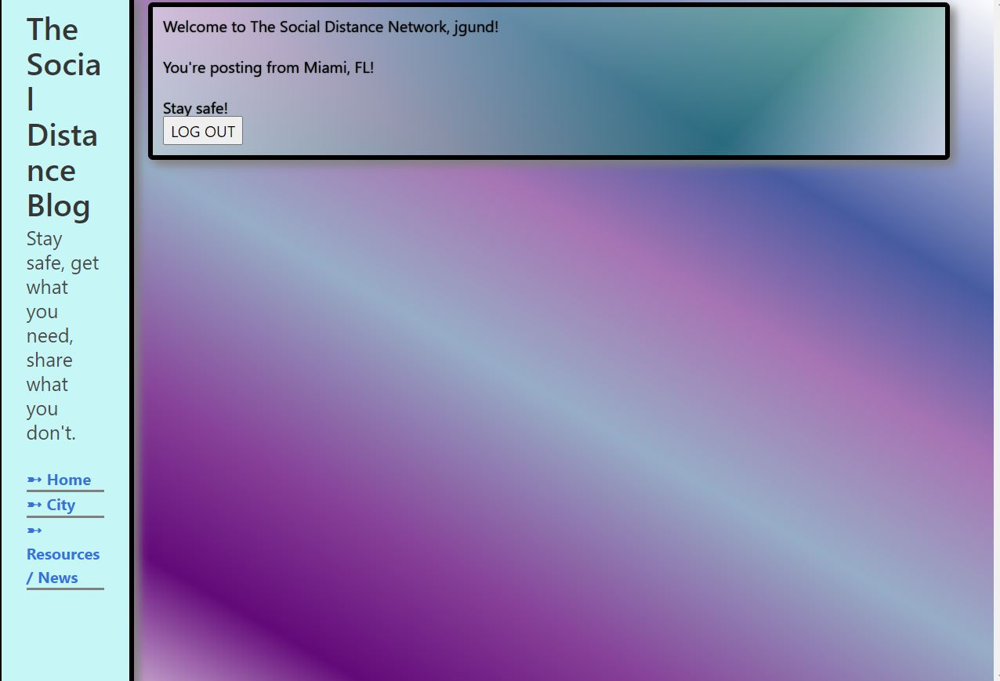
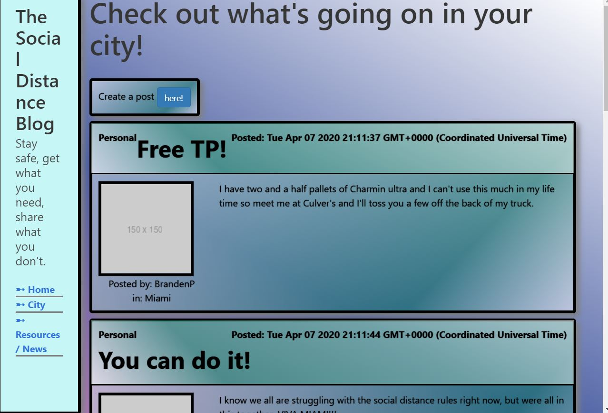
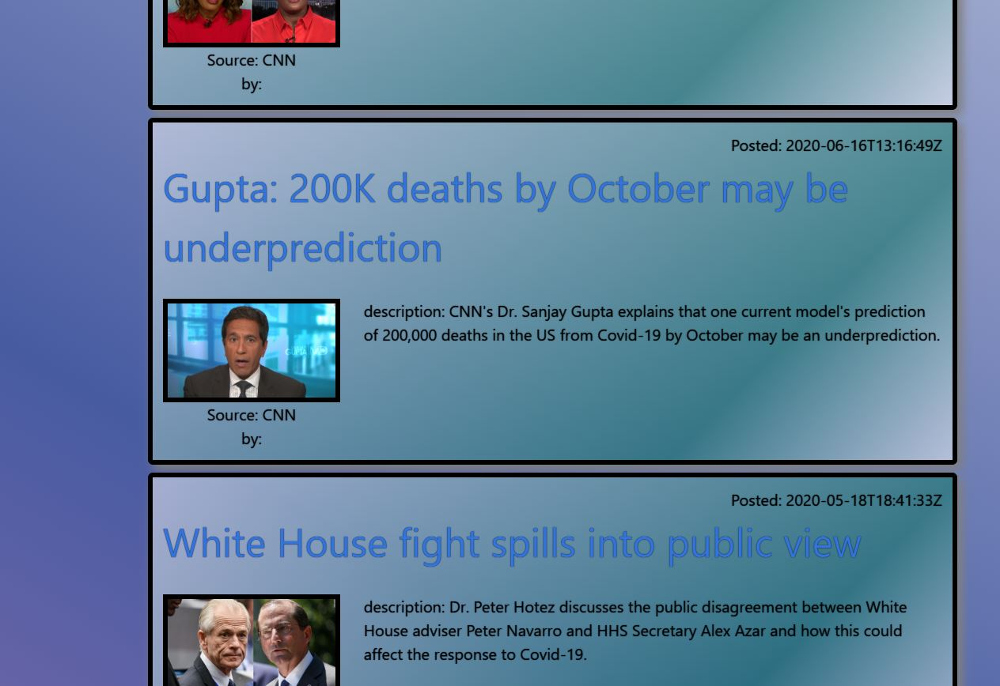

# The Social Distance Network

### What the project does

- This application was designed to help people in the same city interact with eachother through posting to a feed. Users are also able to see a map of their area with resources to get supplies during the quarantine, as well as news updates on the virus.

### Why the project is useful

- This application can help give people the interaction they need with their local area to help curate a feeling of community. Can be a source for positive and motivational messages, as well as helping people get the supplies they need.

### How users can get started with the project

- Visit the site by clicking [here](https://pure-brook-35480.herokuapp.com/login)
- Register or log in, and use the navigation on the left to browse your city, as well as news and resources.

### Project maintenance

- This project is maintained by Branden Patten, Jeff Gunderson, and Alan Ford.

This is a screenshot of the home page:

This is a screenshot of the city page where people can go and blog about events happening in and around their city.

This is a screenshot of the Resources page where people can go and see a map of resources available in their city.

This is a screenshot of the News page where people can go and see covid-19 current news.

